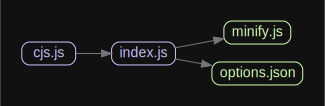

# 源码分析

## 文件结构

``` bash
/Users/liufang/openSource/FunnyLiu/terser-webpack-plugin
├── CHANGELOG.md
├── LICENSE
├── README.md
├── babel.config.js
├── commitlint.config.js
├── husky.config.js
├── jest.config.js
├── lint-staged.config.js
├── package-lock.json
├── package.json
├── src
|  ├── cjs.js
|  ├── index.js
|  ├── minify.js
|  └── options.json
└── tsconfig.json

directory: 12 file: 96

ignored: directory (1)

```

## 外部模块依赖


## 内部模块依赖


  